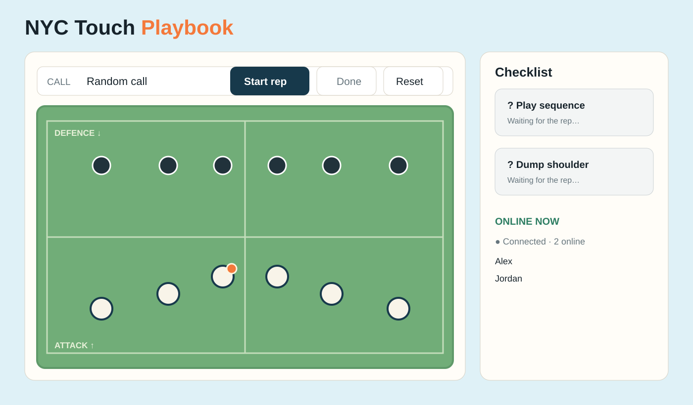
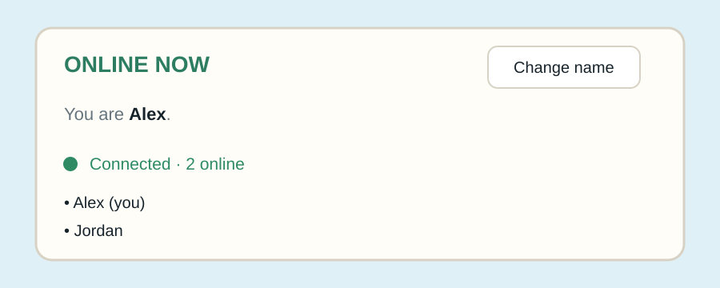

# NYC Touch Playbook

NYC Touch Playbook is a browser-based touch-rugby training tool. Practice the five core calls—Splitter, Rooster, Sweeper, Hot Dog, and ML—by moving attackers, dragging the ball, and reviewing a play-specific checklist.

## Use it online

Open the permanent live site:

**[https://nyctouch-b43f2.web.app](https://nyctouch-b43f2.web.app)**

When the page opens:

1. Enter a nickname in the “Join the practice space” dialog.
2. Select **Join practice**. Your name will appear under **Online now**.
3. Open the same link on another device or in a private browser window to invite teammates.
4. Each person practices on their own private field. Seeing someone online does not share or control their game.

The shared service only shows temporary online presence. It does not share player positions, the ball, defenders, play calls, movement history, or checklist results.

### Practice a rep

1. Choose a call, or leave **Random call** selected.
2. Click **Start rep**.
3. Drag the light attackers to run their lines.
4. Tap the ball carrier once to dump.
5. Double-tap an attacker to pick up the dumped ball.
6. Drag the orange ball onto another attacker to pass.
7. Click **Done** to reveal the checklist.
8. Click **Reset** to start the same call again with a neutral gray checklist.

## Screenshots

### Game overview



### Online presence



## Troubleshooting

- **The old dark game appears:** you are probably opening the old local `file:///.../outputs/index.html` file. Use the HTTPS link above, or serve the project root with the local command below.
- **The page says Offline mode:** the game still works locally, but Firebase presence is unavailable. Check your network connection and confirm Anonymous Authentication is enabled in Firebase.
- **Your nickname is rejected:** another person is already using that nickname. Choose a different name; names are unique only while online.
- **The page is blank from a file:** ES modules need HTTP. Do not double-click the HTML file.

## Run locally

From the project root:

```bash
python3 -m http.server 8000
```

Open [http://localhost:8000](http://localhost:8000). The canonical page is the root `index.html`; the `outputs/` copy is kept synchronized for local reference but is not deployed separately.

## Deploy updates

The repository is configured for Firebase Hosting. After making changes:

```bash
firebase use nyctouch
firebase deploy --only hosting,database
```

The Firebase web configuration is stored in `js/firebase-config.js`. Anonymous Authentication and Realtime Database must be enabled in the Firebase Console. Security rules are in `database.rules.json`. The initial Firebase setup and CLI usage are documented in the [Firebase web setup guide](https://firebase.google.com/docs/web/setup) and [Firebase Hosting quickstart](https://firebase.google.com/docs/hosting/quickstart).

## Project structure

- `index.html` — canonical deployed game
- `js/presence.js` — nickname and online-presence integration
- `js/firebase-config.js` — Firebase web configuration
- `database.rules.json` — Realtime Database security rules
- `firebase.json` — Hosting and database deployment configuration
- `outputs/index.html` — synchronized local copy, excluded from Hosting
